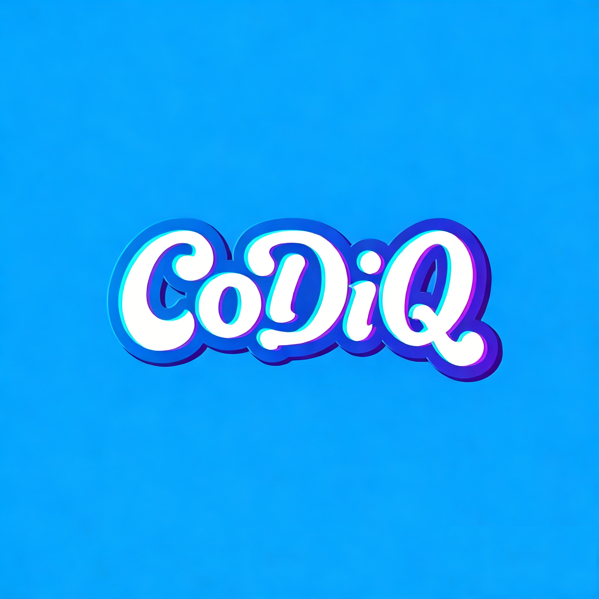
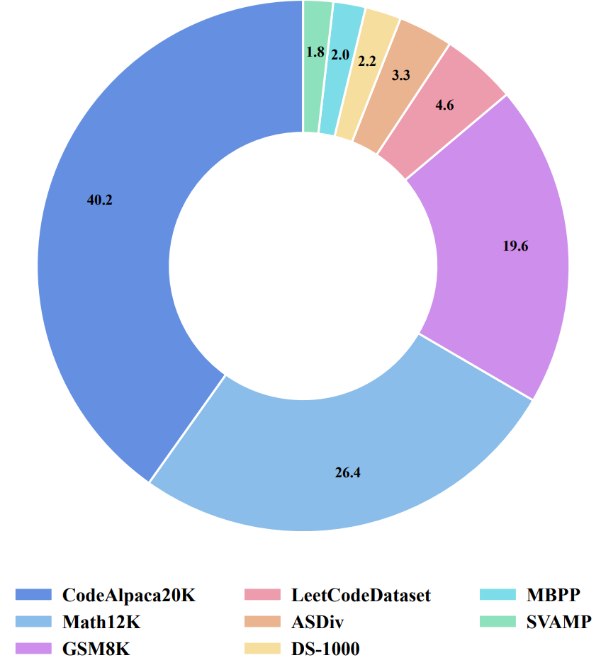
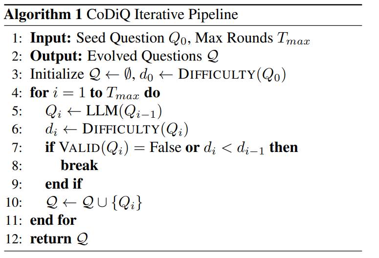
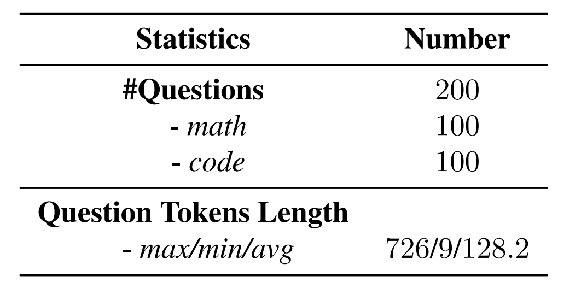
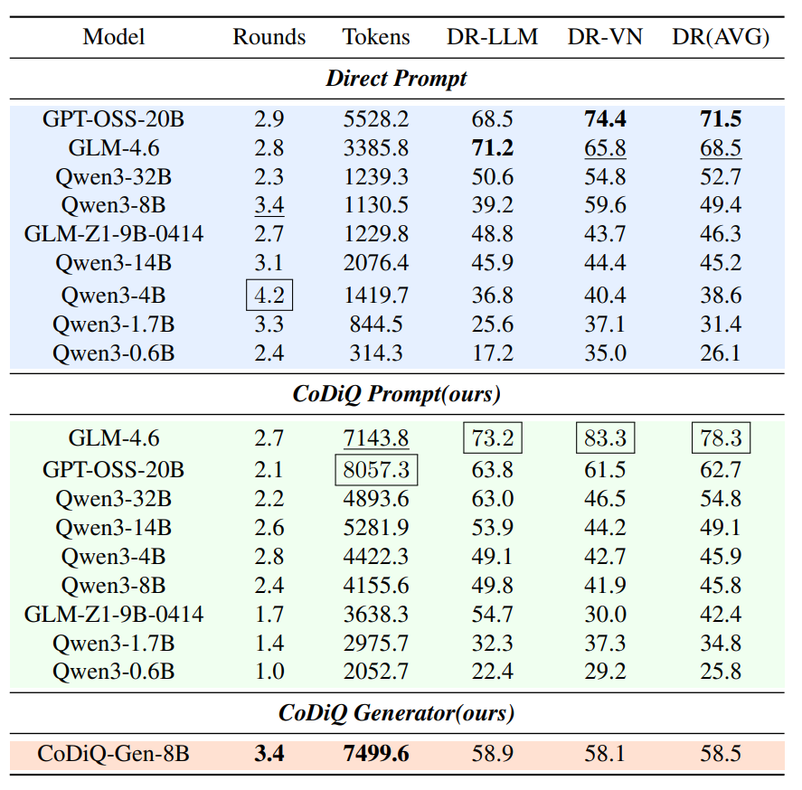
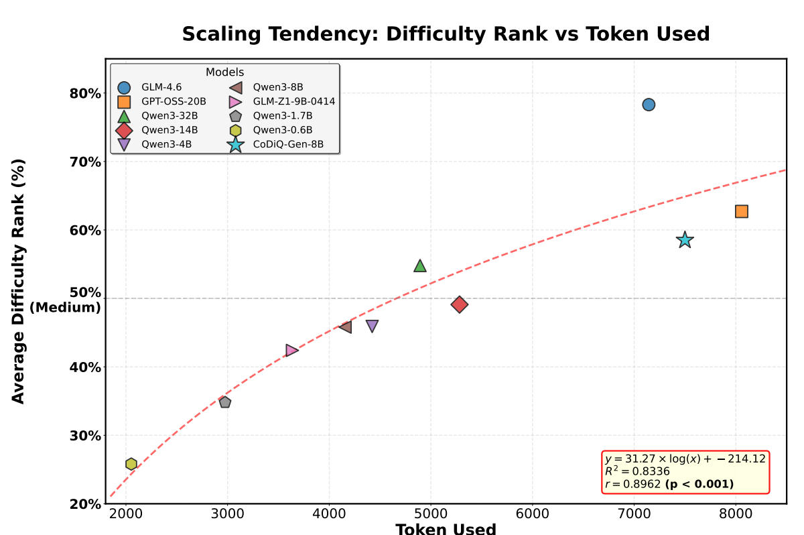
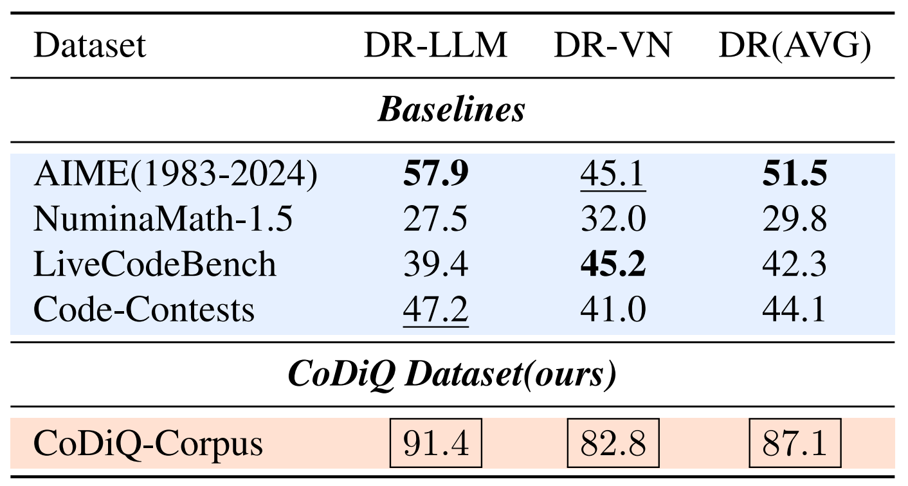
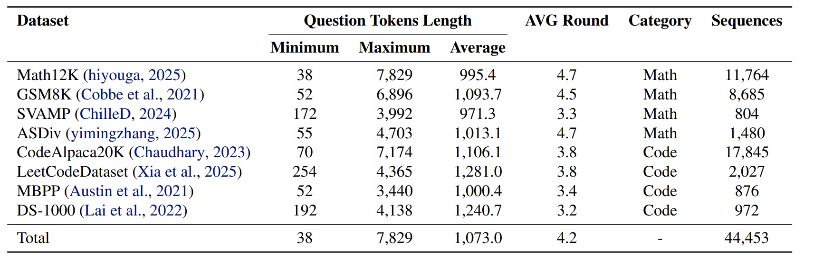

<h1 align="center">

<br>
CoDiQ: Test-Time Scaling for Controllable Difficult Question Generation
</h1>

<p align="center">
  <a href="https://arxiv.org/pdf/2602.01660">
    
  </a>
  <a href="https://huggingface.co/AleXGroup/CoDiQ-Gen-8B">
    
  </a>
  <a href="https://huggingface.co/datasets/AleXGroup/CoDiQ-Corpus">
    
  </a>
  <a href="">
    
  </a>
</p>

<p align="center">
Repo for "<a href="https://arxiv.org/pdf/2602.01660" target="_blank">CoDiQ: Test-Time Scaling for Controllable Difficult Question Generation</a>"
</p>

---

## 🔥 News
* **[2026.02.02]** We release **CoDiQ-Corpus**, containing **44K** competition-grade question sequences!
* **[2026.02.02]** We open-source **CoDiQ-Gen-8B**, a specialized generator trained via RL to synthesize high-difficulty problems.
* **[2026.02.02]** The CoDiQ paper is released. We propose a framework enabling fine-grained difficulty control via test-time scaling.

---

## 💡 Introduction

Large Reasoning Models (LRMs) benefit substantially from training on challenging, competition-level questions. However, existing automated synthesis methods struggle with **"fake hard"** questions—problems that are complex but unsolvable or ill-defined.

**CoDiQ (Controllable Difficult Question Generation)** is a novel framework that enables fine-grained difficulty control via **test-time scaling** while ensuring solvability.

Key innovations include:
1.  **Test-Time Scaling Tendency**: We identify that extending the reasoning token budget boosts difficulty but can reduce solvability.
2.  **CoDiQ-Generator**: A specialized model (finetuned from Qwen3-8B) that improves the upper bound of valid, high-difficulty question generation.
3.  **CoDiQ-Corpus**: A dataset of **44K** competition-grade math and coding question sequences, which is significantly more challenging than LiveCodeBench and AIME.

Training LRMs on CoDiQ-Corpus substantially enhances downstream reasoning performance. The [CoDiQ-Generator](https://huggingface.co/AleXGroup/CoDiQ-Gen-8B) and [CoDiQ-Corpus](https://huggingface.co/datasets/AleXGroup/CoDiQ-Corpus) are released.

<div align="center">
  
  <br>
  <em>Figure 1. Distribution of CoDiQ-Corpus Dataset.</em>
</div>

---

## 🚀 The CoDiQ Framework

The CoDiQ pipeline iteratively evolves a seed question $Q_0$ into harder variants $\{Q_1, ..., Q_n\}$ through a rigorous cycle of generation and verification.

<div align="center">
  
</div>

### 1. Difficulty-Enhancement Strategies
To avoid superficial difficulty, we guide the LLM with six specific cognitive scaffolds:
* **Dimensionality & Constraints**: Exploding data scale/dimensions to invalidate naive simulation.
* **Mathematical Abstraction**: Reframing procedural problems into formal models (e.g., Number Theory).
* **Inverse & Constructive**: Reversing the "Given X find Y" flow to "Construct X such that Y holds".
* **State Explosion**: Enriching DP states or dependencies.
* **Theorem Disguise**: Hiding standard algorithms behind abstract narratives.
* **Edge Case & Rigor**: Targeting precision, overflow, or degenerate cases.

### 2. Hybrid Verification
We ensure quality using two verifiers during the scaling process:
* **Difficulty Estimation**: Uses **LLM-Ranking** and a **ValueNetwork** to ensure monotonic difficulty growth.
* **Solvability Verification**: A reasoner (e.g., Qwen3-32B) checks if the new problem remains well-defined and solvable.


The generation process is terminated if the difficulty becomes non-monotonic or if the newly generated question is unsolvable, in which case the invalid candidate is discarded and the sequence up to the previous step is retained.
 

---

## 📋 CoDiQ-Bench
To systematically evaluate the question generation capability of LRMs, we first construct CoDiQ-Bench, a curated dataset comprising 200 carefully selected cases across coding and mathematical domains.

<div align="center">
  
  <br>
  <em>Table 1. Dataset statistics of CoDiQ-Bench.
  </em>
</div>


---

## 📊 Performance

### Generator Capability
**CoDiQ-Gen-8B** significantly outperforms the larger Qwen3-32B baseline in generating high-difficulty solvable questions on CoDiQ-Bench.

<div align="center">
  
  <em>Table 2. <strong>Performance of different Long-CoT models on CoDiQBench.</strong>  Group rankings based on the highest difficulty of solvable
questions generated across 8 rounds without difficulty degradation
on CoDiQ-Bench. The best, the second-best and the third-best
scores for each indicator are shown in <span style="border:1px solid;padding:2px;">box</span> , <strong>bold</strong> and <u>underlined</u>,
respectively.
  </em>
</div>

### Difficulty Scaling
We highlight the positive correlation between token volume and difficulty rankings shown in the following Figure.

<div align="center">
  
  <br>
  <em>Figure 2. <strong>Question Difficulty Scaling on CoDiQ-Bench.</strong> Scatter plot showing the relationship between average reasoning tokens and difficulty ranking (DR-AVG) for models using CoDiQ Prompt. Each point represents a model, demonstrating the positive correlation between increased reasoning computation and generated problem difficulty.
  </em>
</div>


## 📋 CoDiQ-Corpus
### Difficulty of CoDiQ-Corpus
**CoDiQ-Corpus** achieves higher difficulty ratings compared to standard competition benchmarks.

<div align="center">
  
  <br>
  <em>Table 3. <strong>Datasets Difficulty Comparison. </strong>  The best, the second-best and the third-best
scores for each indicator are shown in <span style="border:1px solid;padding:2px;">box</span> , <strong>bold</strong> and <u>underlined</u>,
respectively.
  </em>
</div>

### Statistics of CoDiQ-Corpus
We employ **CoDiQ-Gen-8B** following the **CoDiQ Pipeline** to transform eight diverse mathematical and programming datasets into the more challenging CoDiQ-Corpus, which comprises approximately **44,453** question sequences with progressive difficulty from easy to hard. The detailed distribution is presented in the following Table.

<div align="center">
  
  <em>Table 4. Dataset statistics of CoDiQ-Corpus.
  </em>
</div>


---

## 🛠️ Quick Start

### Installation
```bash
git clone https://github.com/ALEX-nlp/CoDiQ.git
cd CoDiQ
pip install -r requirements.txt
```

### Inference: Generating Difficult Questions

You can leverage `CoDiQ-Gen-8B` to enhance the complexity of any seed problem. To begin, update the configuration in `tools_api.py`, `codiq_api.py`, `count_tokens.py` and then execute the following script:
```bash
bash run.sh
```

---

## 📖 Citation

If you find **CoDiQ** useful for your research, please consider citing our paper:

```bibtex
@article{codiq2026,
  title={CoDiQ: Test-Time Scaling for Controllable Difficult Question Generation},
  author={Zhongyuan Peng, Caijun Xu, Changyi Xiao, Shibo Hong, Eli Zhang, Stephen Huang, Yixin Cao},
  journal={arXiv preprint arXiv:2602.01660},
  year={2026}
}
```